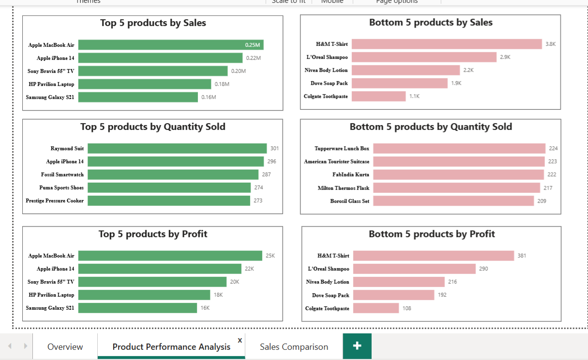
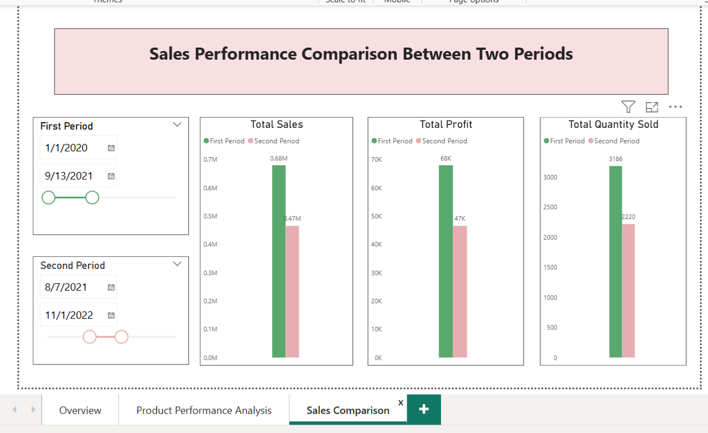

# sales-performance-analysis-dashboard

Sales Performance Analysis Dashboard (Power BI)

🔗 [Live Dashboard](View the interactive Power BI report here: https://app.powerbi.com/view?r=eyJrIjoiMDViNjM2ZWEtNzEwNC00ODIyLTg5MDItYjUxNWQ1N2VjMjI5IiwidCI6ImU2YTU4ZDFjLWE5MzktNDcxNS04MzRjLWNlOGY2ZDQ5NjUzMCIsImMiOjEwfQ%3D%3D)

This project is a fully developed Power BI solution focused on analyzing sales data through interactive dashboards. It transforms raw data into structured visuals to support performance tracking and reporting.

The project includes data preparation, transformation, and modeling within Power BI, followed by the creation of an interactive dashboard with key performance indicators and visual analytics.

Key Features
Data cleaning and transformation using Power Query
Data modeling and relationship building in Power BI
Interactive dashboard with filters, slicers, and drill-down functionality
KPI tracking (Revenue, Orders, Profit, and Sales trends)
Sales performance visualization by product, region, and time period
Structured reporting for sales data analysis

This project demonstrates end-to-end Power BI skills, including data preparation, modeling, and visualization to build a clear and interactive sales reporting system.

 📊 Dashboard Preview

